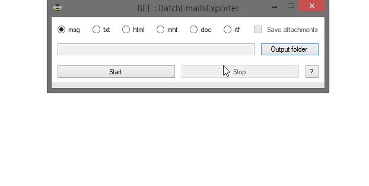

# BEE : BatchEmailsExporter

## About
Windows utility to batch export emails from Microsoft Outlook to .msg, .txt, .html, .mht, .doc and .rtf file formats.  
Select the desired output folder, click `Start`, and Outlook will prompt for an account or an email folder.  
Attachments can be extracted. Yeah, that's cool.

<kbd></kbd>

## Requirements
- Microsoft [.NET Framework 4](https://www.microsoft.com/en-US/download/details.aspx?id=17851
- Microsoft Outlook 2010 or later
- Microsoft Windows Vista or later

## Todo
- Logging
- Localization

## Libraries
- Honeybee emoji :honeybee: from [Twemoji](https://github.com/twitter/twemoji)
  
## License
BatchEmailsExporter is released under the [GNU General Public License v3.0](https://www.gnu.org/licenses/gpl-3.0.fr.html).
